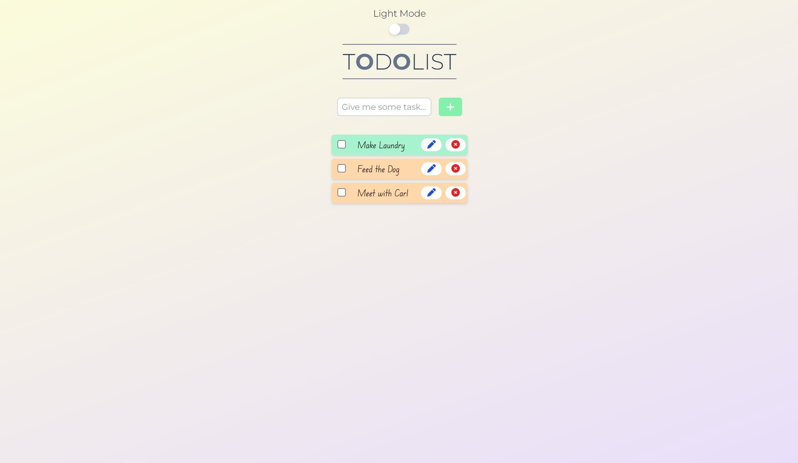

<h1>Todolist Application</h1>

It is a simple todolist web application with react and tailwindcss.  

In this application you can take your notes and tasks. Application uses local storage so everything you write saves on your device.

And Application has beautiful animations with dark and light mode.

<h1>Screenshots</h1>

<h2>Light Mode</h2>

<h2>Dark Mode</h2>

<h1>Try It!</h1>
<a href="https://exe-todolist.netlify.app/">Todolist Application</a>
